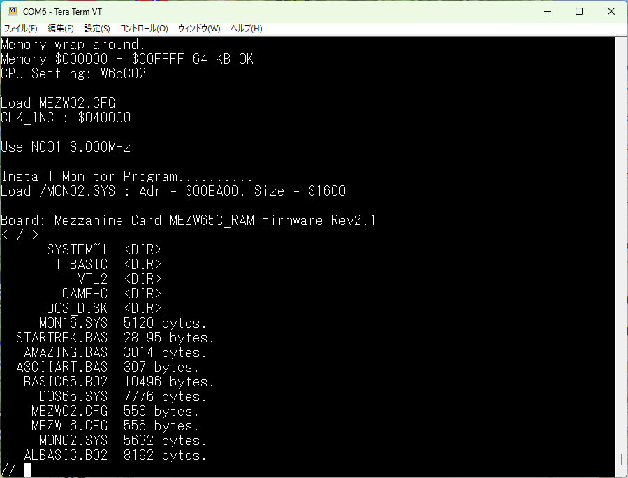
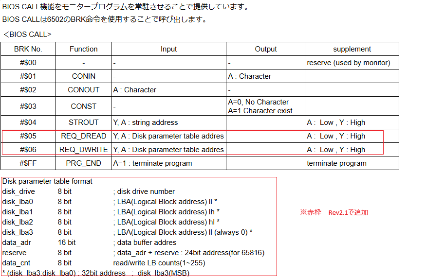
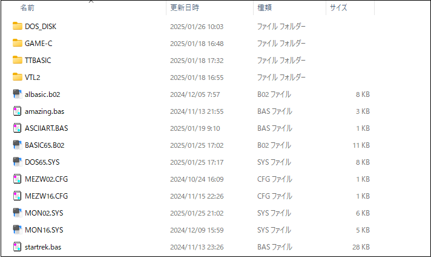
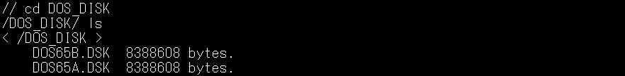

# MEZW65C_RAM ファームウェア Rev2.1
作成中 - Under construction - 

## 特徴
  OSI用の DOS/65を移植し、[Rev2.0](https://github.com/akih-san/MEZW65C_RAM-Rev2.0/tree/main)に追加しました。 
  DOS/65は、Richard氏が、S-100 ベースのシステム向けに作成されました。 
  その後DOS/65は、幾つかのシステムに移植されています。 
  DOS/65はCP/Mの6502版と言えます。同様のものに[cpm65](https://github.com/davidgiven/cpm65?tab=readme-ov-file)がありますが、 
  OSのソースコードは全く別物です。調査してませんので希望的観測ですが、 
  ファンクションコールレベルで互換性があれば。簡単にアプリケーションを 
  移植できるのでは？と思ってます。 
  
  DOS/65の紹介WEBサイト 
  http://retro.hansotten.nl/6502-sbc/dos-65/
  
  Richard氏のWEBサイト 
  http://www.z80.eu/dos65.html
  
   
   -- DOS/65のライセンス -- 
  「DOS/65 ソフトウェアおよびドキュメントは、非営利、教育、または個人使用のための 
  シェアウェアとして提供されています。 
  Richard A. Leary の承認なしにその他の使用は禁止されています。」 
  DOS/65 V3 ROM ソフトウェアおよびその他すべての DOS/65 ソフトウェアはフリー  
  ソフトウェアです。フリー ソフトウェア財団が発行するGNU 一般公衆利用許諾書  
  (ライセンスのバージョン 3 またはそれ以降のバージョン) の条件に従って、 
  再配布および/または改変することができます。 

## 使用上の注意点
DOS/65は、W65C02で動作します。W65C816では、エミュレーションモードで動作します。 
64C02Rev2.1は、DOS/65をサポートするために、常駐するMON02.SYSに追加、変更が加えられています。 
それに伴って、幾つかのアプリケーションに、メモリ配置の変更が必要となりました。 
Rev2.1のリポジトリにソースコードがアップロードされているアプリケーションはRev2.1でしか動作しません。 
それ以外については、Rev2.0用のアプリケーションが動作します。 
 

## Rev2.1で追加された項目
  ファームウェアの使い方は、基本的に[Rev2.0](https://github.com/akih-san/MEZW65C_RAM-Rev2.0)と同じですので、そちらを参照してください。 
 

- ファームウェア コマンド一覧

  
 

- BIOS CALL機能一覧
  
  

  

## SDカードの作成
  4GB，8GB、16GBのFAT32フォーマットのSDカードで動作確認しています。 
  DISKSフォルダの中身をSDカードにコピーします。 
  ただし、DOS_DISKフォルダには2つのディスクイメージ（DOS65A.DSK、DOS65B.DSK）だけを 
  コピーします。DOS_DISK下の他のファイルはディスクイメージを作る際のデータファイルで、 
  SDカード上では不必要なファイルです。 
  DOS65.SYSファイルがDOS/65の本体になります。 

## DOS/65ディスクイメージの作成
- ディスクイメージ 8M(8,388,608バイト)
  - セクタ長　512バイト
  - トラック数　64トラック
  - ブロックサイズ　2048バイト
  - ディレクトリ最大数　1024
  - レコード数/トラック 1024 (1レコード128バイト : 256セクタ/トラック）
  - 最大ブロック数　4096
    
ディスクイメージの作成には幾つかの方法がありますが、neko Javaさんの[CpmtoolsGUI](http://star.gmobb.jp/koji/cgi/wiki.cgi?page=CpmtoolsGUI)を利用しています。 
Windows上で（11で動作確認）簡単にディスクイメージの作成が出来ます。 
DOS/65は、OSで設計上最大8ドライブまで使用可能ですが、MEZW65C_RAMでは2ドライブを実装しています。 
  - ディスクイメージのファイル 
    - DOS65A.DSK : ドライブＡのディスクイメージ 
    - DOS65B.DSK : ドライブＢのディスクイメージ 
 
ＳＤカードのルート上に「DOS_DISK」名のディレクトリを作成し、その下にコピーします。 
 

