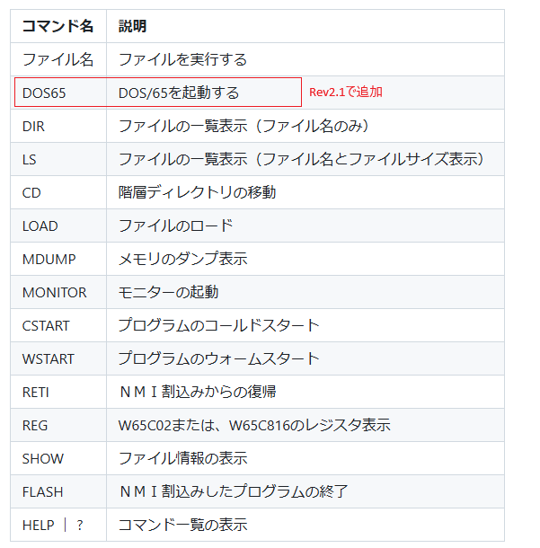
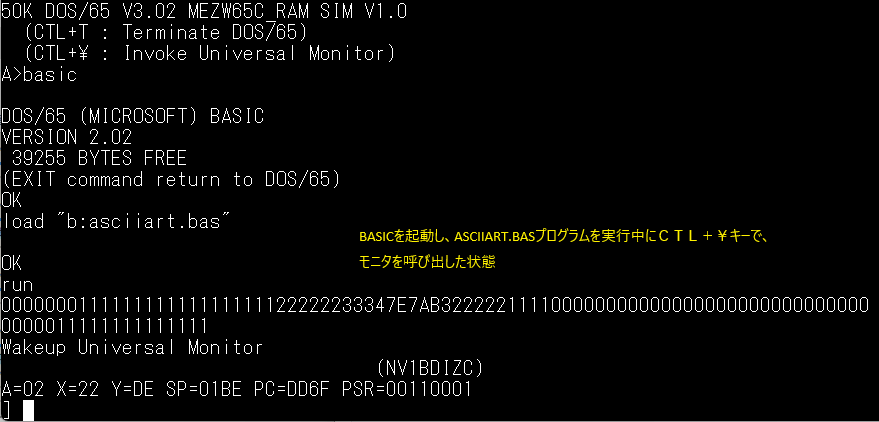

# MEZW65C_RAM ファームウェア Rev2.1

## DOS/65の追加

  [OSI用の DOS/65](https://github.com/osiweb/DOS65/tree/master)を移植し、[Rev2.0](https://github.com/akih-san/MEZW65C_RAM-Rev2.0/tree/main)に追加しました。 
  DOS/65は、Richard氏が、S-100 ベースのシステム向けに作成されました。 
  その後DOS/65は、幾つかのシステムに移植されています。 
  DOS/65はCP/Mの6502版と言えます。同様のものに[cpm65](https://github.com/davidgiven/cpm65?tab=readme-ov-file)がありますが、 
  OSのソースコードは全く別物です。調査してませんので希望的観測ですが、 
  ファンクションコールレベルで互換性があれば、簡単にアプリケーションを 
  移植できるのでは？と思ってます。 
  
  DOS/65の紹介WEBサイト 
  http://retro.hansotten.nl/6502-sbc/dos-65/

  Richard氏のWEBサイト 
  http://www.z80.eu/dos65.html
   
  
  [Kevin Maier氏のDOS/65 
  https://github.com/floobydust  
  彼は、Richard氏と連絡を取り合ってましたが、2020年9月の[RetroBrewフォーラム](https://www.retrobrewcomputers.org/forum/index.php?t=msg&goto=9444&&srch=dos%2F65#msg_9444)への投稿で 
  次のように述べてます。 
  『最近、今年初め以来、Richard からメールの返信を受け取っていません。彼に何通かメールを 
  送りましたが、返信がありません。理由はわかりませんが、先週メールを送ってもまだ返信がありません。 
  彼が元気でいてくれることを願うばかりです。 
  彼は 70 代後半で、おそらく何らかの健康上の問題が影響しているのでしょう。』 
   
-- DOS/65のライセンス -- 
「DOS/65 ソフトウェアおよびドキュメントは、非営利、教育、または個人使用のための 
シェアウェアとして提供されています。 
Richard A. Leary氏の承認なしにその他の使用は禁止されています。」 
DOS/65 V3 ROM ソフトウェアおよびその他すべての DOS/65 ソフトウェアはフリー  
ソフトウェアです。フリー ソフトウェア財団が発行するGNU 一般公衆利用許諾書  
(ライセンスのバージョン 3 またはそれ以降のバージョン) の条件に従って、 
再配布および/または改変することができます。 
   
  現在、既に5年が経過しており、その後どうなったのかについては情報が得られていません。 
  非常に心配です。
  しかし、MEZW65C_RAMは、非営利、個人使用なので、DOS/65を公開しても問題ないと思っています。 

## 使用上の注意点
DOS/65は、W65C02で動作します。W65C816では、エミュレーションモードで動作します。 
64C02Rev2.1は、DOS/65をサポートするために、常駐するMON02.SYSに追加、変更が加えられています。 
それに伴って、幾つかのアプリケーションに、メモリ配置の変更が必要となりました。 
Rev2.1のリポジトリにソースコードがアップロードされているアプリケーションはRev2.1でしか動作しません。 
それ以外については、Rev2.0用のアプリケーションが動作します。 
 

## ファームウェアRev2.1で追加された項目
  ファームウェアの使い方は、基本的に[ファームウェアRev2.0](https://github.com/akih-san/MEZW65C_RAM-Rev2.0)と同じですので、そちらを参照してください。 
 

- ファームウェア コマンド一覧

  
 

- BIOS CALL機能一覧
  
  

  

## SDカードの作成
  4GB，8GB、16GBのFAT32フォーマットのSDカードで動作確認しています。 
  DISKSフォルダの中身をSDカードにコピーします。 
  ただし、DOS_DISKフォルダには2つのディスクイメージ（DOS65A.DSK、DOS65B.DSK）だけを 
  コピーします。DOS_DISK下の他のファイルはディスクイメージを作る際のデータファイルで、 
  SDカード上では不必要なファイルです。 
  DOS65.SYSファイルがDOS/65の本体になります。 

## DOS/65ディスクイメージの作成
- ディスクイメージ 8M(8,388,608バイト)
  - セクタ長　512バイト
  - トラック数　64トラック
  - ブロックサイズ　2048バイト
  - ディレクトリ最大数　1024
  - レコード数/トラック 1024 (1レコード128バイト : 256セクタ/トラック）
  - 最大ブロック数　4096
    
ディスクイメージの作成には幾つかの方法がありますが、neko Javaさんの[CpmtoolsGUI](http://star.gmobb.jp/koji/cgi/wiki.cgi?page=CpmtoolsGUI)を利用しています。 
Windows上で（11で動作確認）簡単にディスクイメージの作成が出来ます。 
DOS/65は、OSで設計上最大8ドライブまで使用可能ですが、MEZW65C_RAMでは2ドライブを実装しています。 
  - ディスクイメージのファイル 
    - DOS65A.DSK : ドライブＡのディスクイメージ 
    - DOS65B.DSK : ドライブＢのディスクイメージ 
 
ＳＤカードのルート上に「DOS_DISK」名のディレクトリを作成し、その下にコピーします。 
 

## DEBUGプログラムは動作出来ない （モニタの呼び出し機能を使ってデバッグ）
DOS/65のオリジナルDEBUGプログラムは、IRQ/BRKのベクタを書き換えます。しかしファームウェアRev2.1は 
IRQ/BRKを使って周期的にコンソール入出力を管理しているため、DEBUGを動かすことが出来ません。 
Rev2.1では、DEBUGの代わりに、常駐モニタを呼び出す機能を用意しています。 
DOS/65が起動している状態で、コンソール入力待ち（もしくは、キー入力チェック）の時に、 
ＣＴＬ＋￥キーを入力することでモニタが立ち上がります。 
このモニタの呼び出し機能を使用して、いつでもプログラムをデバッグすることが出来ます。 

 
モニタは、BYEコマンドでモニタを終了すると、呼び出し元に戻ります。 
ファームウェアから、monitorコマンドで呼び出したときは、ファームウェアに戻り、 
DOS/65から、ＣＴＬ＋￥キーで呼び出した場合は、DOS/65に戻ります。 
 

## 開発環境
- Rev2.0のソースのコンパイルは、マイクロチップ社のMPLAB X IDE v6.20を使用しています。
  - [MPLAB® X Integrated Development Environment (IDE)](https://www.microchip.com/en-us/tools-resources/develop/mplab-x-ide)
 

- The Western Design Center, Inc.が提供しているアセンブラ、cコンパイラを含む統合開発環境
  - [WDCTools](https://wdc65xx.com/WDCTools)
 

- フリーで現役の6502用Cコンパイラです。
  - [CC65](https://cc65.github.io/)
 

- モトローラフォーマットのヘキサファイルとバイナリファイル相互変換ツール
  - [bin2mot.exe、mot2bin.exe](https://sourceforge.net/projects/bin2mot/files/)
 

- 6502用の2 パス ポータブル クロス アセンブラ
  - [xa (xa65) Version 2.4.1](https://www.floodgap.com/retrotech/xa/)
 

- 数多くののCPUに対応したマクロアセンブラ
  - [ASW,ASL](http://john.ccac.rwth-aachen.de:8000/as/)
 

- FatFsはR0.15を使用しています。
  - [FatFs - Generic FAT Filesystem Module](http://elm-chan.org/fsw/ff/00index_e.html)
 

## PIC18F47Q43/Q84/Q83への書き込み
- マイクロチップ社の書き込みツールです。
  - [snap](https://www.microchip.com/en-us/development-tool/PG164100)
 

- PICkitminus書き込みソフトを用いて、書き込むことが出来ます。以下で入手できます。
  - [PICkitminus](http://kair.us/projects/pickitminus/)
 

PICへの書き込みツールを用いて、ヘキサファイルを書き込みます。 
 
- PIC18F47Q43 - R2.1q43.hex
- PIC18F47Q84 - R2.1q84.hex
- PIC18F47Q83 - R2.1q83.hex
 
